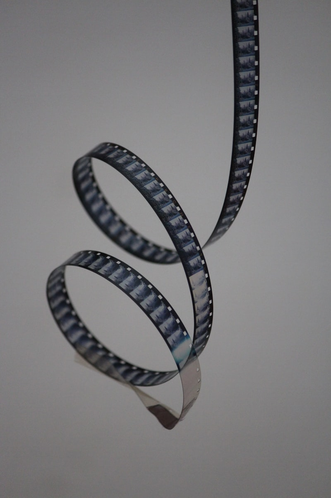
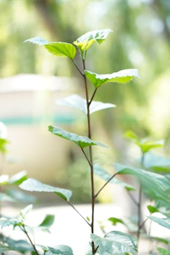

# Itinerario Japón 2026

Este documento recoge el itinerario detallado, día a día, del viaje a Japón del 4 al 19 de marzo de 2026. Cada actividad está documentada con descripción, tiempos estimados, enlaces de compra y recursos visuales.

## Índice
- [Día 1: Llegada y Osaka](#día-1)
- [Día 2: Osaka clásico](#día-2)
- [Día 3: Universal Studios Japan](#día-3)
- [Día 4: Osaka compras](#día-4)
- [Día 5: Traslado a Kioto y Arashiyama](#día-5)
- [Día 6: Fushimi Inari y Higashiyama](#día-6)
- [Día 7: Nara](#día-7)
- [Día 8: Kyoto extra](#día-8)
- [Día 9: Shinkansen a Tokio y Shibuya](#día-9)
- [Día 10: Asakusa y Skytree](#día-10)
- [Día 11: Akihabara y Ueno](#día-11)
- [Día 12: Hakone/Nikko](#día-12)
- [Día 13: Harajuku y Meiji Jingu](#día-13)
- [Día 14: Toyosu/Tsukiji y Ginza](#día-14)
- [Día 15: Salida desde Tokio](#día-15)

---

## Día 1: Llegada y Osaka
### Llegada a Tokio
- Trámites migratorios y recogida de equipaje.
- Compra de tarjeta IC (Suica/ICOCA) y SIM/pocket Wi-Fi.
- 

### Vuelo Tokio → Osaka
- Vuelo doméstico (ANA/JAL/Peach/Jetstar).
- Reserva: [ANA](https://www.ana.co.jp), [JAL](https://www.jal.co.jp), [Peach](https://www.flypeach.com), [Jetstar](https://www.jetstar.com)

### Check-in y Dotonbori
- Paseo por Dotonbori, comida callejera y ambiente nocturno.
- Mapa: [Google Maps](https://www.google.com/maps/dir/Osaka+Airport+(ITM)/Namba+Dotonbori)

---

## Día 2: Osaka clásico
### Castillo de Osaka
- Fortaleza histórica, museo y jardines.
- 
- Entradas: [Oficial](https://osakacastle.net/)
- Mapa: [Google Maps](https://www.google.com/maps/place/Osaka+Castle)

### Umeda Sky Building
- Mirador panorámico.
- 
- Entradas: [Oficial](https://www.kuchu-teien.com/)
- Mapa: [Google Maps](https://www.google.com/maps/place/Umeda+Sky+Building)

### Shinsekai y Tsutenkaku
- Barrio retro, kushikatsu y ambiente local.
- 

---

## Día 3: Universal Studios Japan
- Parque temático (Harry Potter, Minions, etc.)
- 
- Entradas: [Oficial](https://www.usj.co.jp/e/ticket/)
- Mapa: [Google Maps](https://www.google.com/maps/place/Universal+Studios+Japan)

---

## Día 4: Osaka compras
### Kuromon Ichiba Market
- Mercado clásico, mariscos y snacks.
- 
- Mapa: [Google Maps](https://www.google.com/maps/place/Kuromon+Ichiba)

### Shinsaibashi / Amerikamura
- Compras y cultura juvenil.
- Mapa: [Google Maps](https://www.google.com/maps/dir/Kuromon+Ichiba/Shinsaibashi)

---

## Día 5: Traslado a Kioto y Arashiyama
### Traslado Osaka → Kyoto
- Tren local o rápido (30–50 min).

### Arashiyama Bamboo Grove y Tenryu-ji
- Bosque de bambú y templo.
- 
- Mapa: [Google Maps](https://www.google.com/maps/place/Arashiyama+Bamboo+Grove)

---

## Día 6: Fushimi Inari y Higashiyama
### Fushimi Inari Taisha
- Santuario de torii naranjas.
- 
- Mapa: [Google Maps](https://www.google.com/maps/place/Fushimi+Inari+Taisha)

### Kiyomizu-dera y Gion
- Templo y barrio tradicional.
- Mapa: [Google Maps](https://www.google.com/maps/place/Kiyomizu-dera)

---

## Día 7: Nara
### Nara Park y Todai-ji
- Parque de ciervos y Gran Buda.
- 
- Entradas: [Todai-ji](https://www.todaiji.or.jp/)
- Mapa: [Google Maps](https://www.google.com/maps/place/Nara+Park)

---

## Día 8: Kyoto extra
### Nishiki Market
- Mercado cubierto y gastronomía.
- 
- Mapa: [Google Maps](https://www.google.com/maps/place/Nishiki+Market)

### Ginkaku-ji / Philosopher's Path
- Templo y paseo junto al canal.

---

## Día 9: Shinkansen a Tokio y Shibuya
### Shinkansen Kyoto → Tokio
- Reserva asiento Hikari/Nozomi.
- [JR Central](https://global.jr-central.co.jp/)

### Shibuya Crossing y Hachiko
- Cruce famoso y estatua de Hachiko.
- 
- Mapa: [Google Maps](https://www.google.com/maps/dir/Kyoto+Station/Shibuya+Crossing)

---

## Día 10: Asakusa y Skytree
### Senso-ji y Nakamise-dori
- Templo histórico y souvenirs.
- 

### Tokyo Skytree
- Torre y observatorio.
- Entradas: [Oficial](https://www.tokyo-skytree.jp/en/)

---

## Día 11: Akihabara y Ueno
### Akihabara
- Electrónica, manga y cafés temáticos.
- 

### Ueno Park y museos
- Museo Nacional de Tokio.
- Entradas: [Tokyo National Museum](https://www.tnm.jp/)

---

## Día 12: Hakone/Nikko
### Hakone
- Onsen y vistas al Monte Fuji.
- 
- [Hakone Free Pass](https://www.odakyu.jp/english/passes/)

### Nikko
- Templos UNESCO.

---

## Día 13: Harajuku y Meiji Jingu
### Meiji Jingu y Yoyogi Park
- Santuario y bosque urbano.
- 

### Harajuku / Takeshita Street
- Cultura juvenil y boutiques.

---

## Día 14: Toyosu/Tsukiji y Ginza
### Toyosu Market / Tsukiji Outer Market
- Mercado moderno y sushi fresco.
- 
- [Toyosu Market](https://www.toyosu-market.or.jp/en/)

### Ginza
- Compras y paseos.

---

## Día 15: Salida desde Tokio
### Traslado al aeropuerto
- Calcula tiempos (Haneda 30–45 min; Narita 60–90 min).

---

## Enlaces útiles
- [Universal Studios Japan](https://www.usj.co.jp/e/ticket/)
- [Shinkansen JR Central](https://global.jr-central.co.jp/)
- [Hakone Free Pass](https://www.odakyu.jp/english/passes/)
- [Tokyo Skytree](https://www.tokyo-skytree.jp/en/)
- [Tokyo National Museum](https://www.tnm.jp/)
- [Toyosu Market](https://www.toyosu-market.or.jp/en/)
- [JR Pass info](https://japanrailpass.net/)

---

Este itinerario se irá ampliando y mejorando con experiencias, fotos y consejos tras el viaje.