# 🇯🇵 Itinerario Japón 5–19 Marzo 2026

---

## ✈️ Fechas de Vuelo Claves

- **Salida:** 4 Mar 2026 — Bilbao 09:25 → Escala Zürich 13:00 → Tokio (llegada 5 Mar 10:15 hora local)
- **Vuelo doméstico:** 5 Mar — Tokio → Osaka (≈1 h) con llegada a Osaka ≈ 13:00
- **Regreso:** 19 Mar 2026 — Tokio 10:30 → Zürich → Bilbao (llegada 23:30)

---

## 🏨 Resumen de Estancia

| Ciudad    | Fechas         | Noches | Hotel + Zona recomendada                               |
| --------- | -------------- | ------ | ------------------------------------------------------ |
| Osaka     | 5–9 marzo      | 5      | Umeda/Namba (Granvia Osaka, Hankyu RESPIRE)            |
| Kyoto     | 9–13 marzo     | 4      | Estación Kyoto (Granvia Kyoto, Onyado Nono)            |
| Tokio     | 13–19 marzo    | 6      | Shinjuku/Ginza (Tokyo Station Hotel, Gracery Shinjuku) |
| **Total** | **5–19 marzo** | **15** | —                                                      |

---

## 💰 Presupuesto

### Tabla de Gastos por Persona

| Concepto          | Costo Total | Costo/Persona | Rango |
|-------------------|-------------|---------------|-------|
| **Vuelos**        | 860€        | **860€**      | Fijo |
| **Hotel Osaka**   | 290,30€     | **48,38€**    | Fijo |
| **Hotel Kioto**   | 517,14€     | **86,19€**    | Fijo |
| **Hotel Tokio**   | 1017€       | **169,50€**   | Fijo |
| **Subtotal Alojamiento** | 1824,44€ | **304,07€** | Fijo |
| — | — | — | — |
| **Osaka (comidas + actividades)** | — | **€475–525** | Estimado |
| **Kioto (comidas + actividades + Shinkansen)** | — | **€193–256** | Estimado |
| **Tokio (comidas + actividades + GTR + Friki)** | — | **€408–795** | Estimado |
| **Subtotal Actividades** | — | **€1,076–1,576** | Estimado |
| — | — | — | — |
| **TOTAL GENERAL** | **~3,900–4,400€** | **~1,650–1,900€** | **Variable** |

*Nota: Vuelos y alojamiento ya están pagados (€1,164 por persona). La tabla incluye estimaciones de comidas, transporte local (metro, taxis), entradas a museos/templos, y experiencias premium (Universal EXPRESS PASS, GTR alquiler, etc.). Las compras/souvenirs son adicionales según preferencia.*

---

## 🏨 Hoteles

### Osaka — Shin Zhai Qiao House
**Ubicación:** Prefectura de Osaka, Osaka, 1-8-27 Higashishinsaibashi, Chuo Ward, Japón  
**Precio:** 290,30€ total (48,38€/persona × 6)  
**Enlace:** [Booking](https://www.booking.com/hotel/jp/xin-zhai-qiao-hausu.es.html?aid=397656&label=duc511jc-10CAEoggI46AdIM1gDaEaIAQGYATO4ARnIAQ_YAQPoAQH4AQGIAgGoAgG4AsSHtskGwAIB0gIkYjI1ZGNhNWYtY2JhZS00NzU0LTk5NjUtYjJmNDQyMzAxZjgw2AIB4AIB&sid=340cd0147f2000df251ade053c1b552b&dist=0&group_adults=2&group_children=0&hapos=1&hpos=1&no_rooms=1&req_adults=2&req_children=0&room1=A%2CA&sb_price_type=total&sr_order=distance_from_search&srepoch=1764590566&srpvid=c14d54af78f1016b&type=total&ucfs=1&)

**🚇 A Dotonbori:**
- Línea Midosuji (línea azul) → parada **Namba** (≈10 min caminando)
- Alternativa: Línea Tanimachi → Namba

**🍜 Para cenar:**
- Dotonbori mismo (takoyaki, okonomiyaki, ramen)
- Shinchi (bares de copas y izakayas)

### Kioto — Oaks Kyoto Shijo
**Ubicación:** Kioto, Kioto, Shimogyo-ku Shijo Nishinotouin 59-61, Japón  
**Precio:** 517,14€ total (86,19€/persona × 6)  
**Enlace:** [Booking](https://www.booking.com/hotel/jp/oaks-kyoto-shijo.es.html?label=duc511jc-10CAEoggI46AdIM1gDaEaIAQGYATO4ARnIAQ_YAQPoAQH4AQGIAgGoAgG4AsSHtskGwAIB0gIkYjI1ZGNhNWYtY2JhZS00NzU0LTk5NjUtYjJmNDQyMzAxZjgw2AIB4AIB&sid=340cd0147f2000df251ade053c1b552b&aid=397656&ucfs=1&arphpl=1&dest_id=252727&dest_type=hotel&group_adults=2&req_adults=2&no_rooms=1&group_children=0&req_children=0&hpos=1&hapos=1&sr_order=popularity&srpvid=cbf354cd2e0e012d&srepoch=1764590624&from=searchresults)

**🚇 Transporte:**
- Línea **Hankyu Kawaramachi**, parada **Kawaramachi** (directa desde estación de Kyoto)

**🍜 Para cenar:**
- Kawaramachi (compras, restaurantes, izakayas modernas)
- Gion (más tradicional, geishas, kaiseki restaurants)

### Tokio — Villa Roppongi
**Ubicación:** Prefectura de Tokio, Tokio, ７−１０−１９ Villa Roppongi, Japón  
**Precio:** 1017€ total (169,50€/persona × 6)  
**Enlace:** [Booking](https://www.booking.com/hotel/jp/villa-roppongi.es.html?label=duc511jc-10CAEoggI46AdIM1gDaEaIAQGYATO4ARnIAQ_YAQPoAQH4AQGIAgGoAgG4AsSHtskGwAIB0gIkYjI1ZGNhNWYtY2JhZS00NzU0LTk5NjUtYjJmNDQyMzAxZjgw2AIB4AIB&sid=340cd0147f2000df251ade053c1b552b&aid=397656&ucfs=1&arphpl=1&dest_id=7507794&dest_type=hotel&group_adults=2&req_adults=2&no_rooms=1&group_children=0&req_children=0&hpos=1&hapos=1&sr_order=popularity&srpvid=6c8554ea686a003d&srepoch=1764590682&from=searchresults)

**🚇 A Shibuya:**
- Línea **Hibiya** (roja) → parada **Roppongi** (2 paradas hasta Shibuya, ≈5 min)
- Alternativa a Shinjuku: Línea **Oedo** → parada Roppongi (≈20 min)

**🍜 Para cenar:**
- **Roppongi mismo:** Bares sofisticados, restaurantes internacionales
- **Shibuya:** Trendy, más joven, izakayas animadas
- **Ginza:** Upscale, kaiseki, sushi de lujo

---

## 🚆 Transporte y JR Pass

- **No comprar JR Pass** → más económico usar billetes puntuales + tarjeta IC (Suica/ICOCA).
- **Costos estimados:**
  - Vuelo doméstico Tokio→Osaka: ¥8,000–15,000
  - Shinkansen Kyoto→Tokio: ¥13,320 (asiento reservado)
  - Tarjeta IC (Suica/ICOCA): ¥2,000–3,000 (carga + depósito reutilizable)

### Añadir Suica / tarjeta IC al móvil (iPhone y Android)

Si queréis usar la tarjeta IC sin cargar billetes en cada estación, lo más cómodo es añadir una **Suica** al móvil. Instrucciones prácticas:

iPhone (Apple Wallet)
- Requisitos: iPhone con NFC (iPhone 8 o posterior recomendado) y iOS actualizado.
- Pasos:
  1. Abre la app **Wallet**.
  2. Pulsa **+** (añadir) → elige **Transit Card** o busca **Suica**.
  3. Sigue los pasos para crear y recargar una **Suica** con tarjeta bancaria o Apple Pay. También puedes transferir una Suica física a Wallet si la opción está disponible.
  4. Comprueba saldo desde Wallet; recarga rápida dentro de la app.
- Notas:
  - Si no ves la opción Suica, cambia temporalmente la región de tu Apple ID/ dispositivo a **Japón** o instala la app **Mobile Suica** (requiere registro). Tras añadir la tarjeta puedes volver a tu región habitual.
  - Para Apple Watch, añade la tarjeta desde la app Watch → Wallet & Apple Pay.

Android (Google Pay / Mobile Suica)
- Requisitos: Android con NFC y Google Play Services actualizado; algunos dispositivos requieren compatibilidad con HCE.
- Opciones:
  - **Google Pay (si soporta transit cards en tu dispositivo):** Abre Google Pay → Añadir → Pago/Transit → buscar **Suica** o tarjeta IC y seguir instrucciones para crear/recargar.
  - **Mobile Suica (JR East):** Instala la app **Mobile Suica** (disponible en Google Play en Japón). Permite crear, recargar y gestionar Suica; suele requerir registro y número de tarjeta.
- Notas:
  - Si la app no aparece en tu Play Store fuera de Japón, puedes cambiar temporalmente tu país de Google Play o descargar el APK desde fuente oficial (proceded con precaución).
  - En Osaka es común usar **ICOCA**; verifica compatibilidad en Google Pay o apps locales.

Consejos prácticos
- Recarga recomendada al inicio: ¥2,000–3,000 para cubrir días de transporte y pequeñas compras.
- Si compartís pagos, cada persona debe tener su propia tarjeta en el móvil.
- Guardad captura de pantalla del saldo y del número de tarjeta (por si perdéis acceso) y registrad la tarjeta en la app para poder recuperarla.

---

## 📅 Itinerario Completo — RESUMEN (4–19 marzo 2026)

- **Miér 4 Mar:** Vuelo Bilbao → Zürich → Tokio (noche en vuelo, sin turismo real).  
- **Jue 5 Mar — Día 1:** Llegada a Osaka (~13:00), traslado al hotel y noche en **Dotonbori** (primer paseo y cena).  
- **Vie 6 Mar — Día 2:** **Universal Studios Japan** con EXPRESS PASS (día completo de parque).  
- **Sáb 7 Mar — Día 3:** **Osaka otaku:** Den Den Town (Super Potato, Mandarake, Kaiyodo, Bandai) + **Pokémon Center** + Shinsekai de noche.  
- **Dom 8 Mar — Día 4:** **Castillo de Osaka + Umeda Sky Building + Shinsekai** (karaoke opcional).  
- **Lun 9 Mar — Día 5:** **Kuromon Market** + últimas compras en Osaka + tarde friki (Den Den Town / Namba) + **traslado a Kyoto** por la tarde-noche.  
- **Mar 10 Mar — Día 6:** **Kyoto tradicional:** Kiyomizudera + Higashiyama + Gion + Nishiki Market + cena en Pontocho.  
- **Mié 11 Mar — Día 7:** **Norte de Kyoto:** Arashiyama (bambú) + Tenryu-ji + Kinkakuji + Ryoan-ji + Philosopher's Path.  
- **Jue 12 Mar — Día 8:** **Sur de Kyoto:** Fushimi Inari (torii) + Tofuku-ji + Kyoto Tower + última noche en Kyoto.  
- **Vie 13 Mar — Día 9:** Mañana tranquila (Hongan-ji / Kyoto Station) + **Shinkansen Hikari a Tokio** por la tarde, cena en Shinjuku/Ginza.  
- **Sáb 14 Mar — Día 10:** Llegada y primer gran día en Tokio: zonas este/oeste (Asakusa, Akihabara, Ginza, Odaiba) + **Shibuya Sky** + Roppongi fiesta (adaptado del “Megadía”).  
- **Dom 15 Mar — Día 11:** **Meiji Jingu + Harajuku + Yoyogi + Shinjuku Gyoen + Kabukicho + Omoide Yokocho + karaoke.**  
- **Lun 16 Mar — Día 12:** **Landmarks Tokio:** Tsukiji + Palacio Imperial + Hamarikyu + Tokyo Tower + Ueno + Ameyoko + noche con **Nissan GTR** alquiler.  
- **Mar 17 Mar — Día 13:** **ABC Mart + compras finales + día libre** (Shinjuku/Shibuya, centros comerciales, últimas compras).  
- **Mié 18 Mar — Día 14:** **Friki Shopping Day en Tokio:** Nintendo Store + Sony Store + arcades + UFO catcher/gashapon + última noche tranquila.  
- **Jue 19 Mar — Día 15:** **Vuelo Tokio → Zürich → Bilbao** (salida 10:30, llegada noche a Bilbao).

---

## Balance general del viaje

**Perfil del grupo:** Jóvenes friki (anime, Pokemon, Demon Slayer, videojuegos, tendencias TikTok, tuning de coches). Este itinerario está 100% personalizado para vosotros.

**Estructura regional:**
- **Osaka (Días 1-6, 5 noches):** Entrada joven/trendy, Universal Studios, Den Den Town, Pokémon Center, Shinsekai nightlife, Kuromon Market
- **Kyoto (Días 7-10, 4 noches):** Cultura tradicional en 3 días sin repetir (Gion/Nishiki, Arashiyama bamboo, Fushimi Inari), Shinkansen
- **Tokio (Días 11-17, 6 noches + salida):** Intenso y viral: Doikoku, Megadía, Meiji/Harajuku, landmarks, GTR alquiler, Friki Shopping Day, gacha machines

**Observaciones de ritmo:**
- ✅ Día 11 (Sáb): Doikoku de noche = descanso de mañana (dormirás en el tren de regreso)
- ✅ Día 12 (Dom): MEGADÍA brutal pero es sábado = fiesta nocturna garantizada
- ✅ Día 13 (Lun): Meiji+Harajuku más tranquilo para recuperarse
- ✅ Día 14 (Mar): Landmarks clásicos + GTR nocturno = balance perfecto
- ✅ Día 15 (Mié): Compras (ABC Mart) sin prisa
- ✅ Día 16 (Jue): Friki Shopping Day = último día épico (Nintendo, Sony, arcades, gashapon)
- ✅ Día 17 (Vie): Vuelo temprano (10:30) = última noche en Tokio relajada

**Presupuesto total por persona:** €1,164
- Vuelos: €860 (ya pagados)
- Alojamiento: €304 (ya pagados)
- **Actividades/comidas: ~€0** (presupuesto flexible según gasto diario)

**Presupuesto estimado actividades diarias:**
- Osaka: €475–525
- Kyoto: €193–256 (incluye Shinkansen)
- Tokio: €359–725 (incluye GTR alquiler y Friki Shopping; sin Street Kart)
- **Total estimado actividades: €1,027–1,506** (exceeds initial budget pero sin la actividad de karting)

---

## 📍 Día a Día (guía narrativa)

### Día 1 — Miércoles 4 Marzo + Jueves 5 Marzo: Llegada a Osaka (13:00 aprox.)

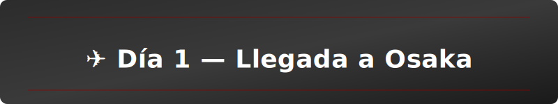

**Mañana/tarde:** Vuelo desde Bilbao (4 de marzo por la mañana), llegada a Kansai (~13:00 el 5 de marzo). Recoger equipaje, cambiar dinero y tomar el **Nankai Airport Express** (¥3,100) o el **JR Haruka** (¥3,600) directo a Osaka/Namba.

**Check-in en hotel** y descanso ligero si el jetlag aún está presente.

**Noche:** Dotonbori es la bienvenida perfecta — luces, letreros icónicos de neón y comida en la calle. Pasea por el canal, prueba **takoyaki** y **okonomiyaki** en puestos locales. Toma fotos en el cartel de Glico (muy instagrameable, 100% viral). Siéntate en una izakaya para una primera cena japonesa.

📱 **Tips friki:** Dotonbori es trend en TikTok; vas a ver el mismo lugar en videos de otros chavales. Aquí empiezas la colección de fotos.

| Horarios Sugeridos |
|---|
| 13:00 – Llegada a Kansai |
| 13:30 – Recogida de equipaje + cambio de dinero |
| 14:30 – Transporte a hotel (~1h) |
| 15:30 – Check-in y descanso breve |
| 18:30 – Paseo por Dotonbori y cena |
| 22:00 – Regreso al hotel |

💰 **Coste (por persona):** ¥2,500–5,000 (transfer + comidas ligeras)

🍜 **Restaurantes recomendados:**
- **Dotonbori Konamon Museum** — takoyaki premium; buena primera impresión gastronómica.
- **Mizuno** — okonomiyaki clásico; local con historia desde los 50s.

🎌 **Alternativa por mal tiempo:** Visitar el **Acuario Kaiyukan** (abierto hasta las 20:00) o centros comerciales climatizados (Namba Parks, Gran Front Osaka).

---

### Día 2 — Viernes 6 Marzo: Universal Studios Japan (Día Completo con EXPRESS PASS)

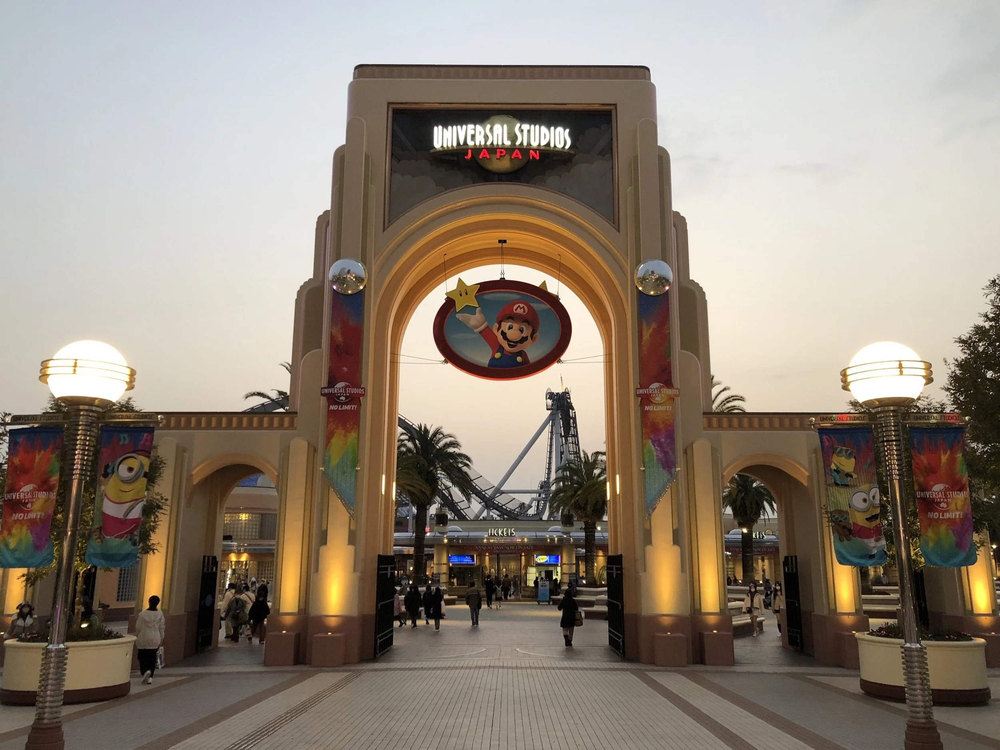

**Plan:** Entrada ANTICIPADA al parque (7:30 si es posible) para maximizar atracciones sin colas. Si contratáis el **EXPRESS PASS**, podéis hacer todas las atracciones premium sin esperar.

#### 🎢 GUÍA DEL EXPRESS PASS — ¿MERECE LA PENA?

| Tipo | Precio | Atracciones | Ideal para |
|---|---|---|---|
| **Express 4** | ¥15,000–22,000 (~€110–160) | 4 atracciones populares (sin colas) | Primer viaje, presupuesto ajustado |
| **Express 7** | ¥25,000–32,000 (~€180–230) | 7 atracciones + shows | Máxima experiencia, sin tiempo perdido |
| **Sin Express** | ¥9,200–13,500 | Colas de 30min–2h por atracción | Tolerancia al calor y la paciencia |

📌 **Recomendación para vuestro grupo:** Comprad el **Express 7** (~€200 pp). Vosotros sois jóvenes, queréis vibraciones y fotos. Dos horas en colas = tiempo perdido. Con Express hacéis TODO.

🔗 **Reserva aquí:** https://www.usj.co.jp/web/en/tickets

#### 🎪 ATRACCIONES MUST-DO:

| Atracción | Duración | Experiencia |
|---|---|---|
| **Harry Potter: Forbidden Journey** | 5 min + 1h cola (sin Express) | Castillo INCREÍBLE. Mejor que la película. |
| **Super Nintendo World** | 5–15 min | Mario Kart AR = viral TikTok |
| **Minion Park** | 15 min | Bananas everywhere, muy divertido |
| **Transformer** | 4 min | Acción pura, simulador brutal |
| **Jaws** | 8 min | Clásico de acción con agua |

| Horarios Sugeridos |
|---|
| 07:00 – Salida del hotel (IMPORTANTE: temprano) |
| 08:00 – Llegada a USJ, comprar Express Pass en taquilla (si no lo hiciste online) |
| 08:30 – Entrada al parque |
| 08:45 – Harry Potter (con Express: directo; sin Express: cola monumental) |
| 10:30 – Super Nintendo World (AR Mario Kart) |
| 12:30 – Almuerzo dentro del parque (Three Broomsticks = temático) |
| 14:00 – Transformer, Minion Park, otros shows |
| 17:00 – Shows y tiendas para souvenirs |
| 19:00–20:00 – Regreso a hotel |

💰 **Coste (por persona):**
- Entrada: ¥9,200–13,500 (~€65–95)
- Express 7: ¥25,000–32,000 (~€180–230)
- Comidas dentro: ¥3,000–5,000 (~€20–35)
- **Total: €265–360 por persona**

🍗 **Comida dentro del parque (oficial):**
- **Three Broomsticks Butterbeer** — bebida de tema Harry Potter, fotos obligatorias
- **Mel's Drive-In** — hamburguesas clásicas, rápido y económico

🎬 **Tip viral:** Comprad el **Butterbeer** en Three Broomsticks. Es crema con sabor a caramelo. Todos los instagramers de Japón lo hacen.

---

### Día 3 — Sábado 7 Marzo: Osaka Otaku + Den Den Town + Pokémon Center

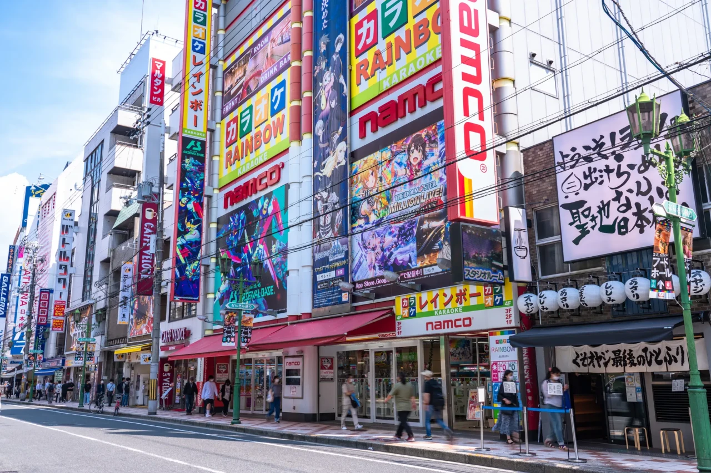

**Mañana:** Desayuna ligero en el hotel y dirige hacia **Nipponbashi (Den Den Town)** — el corazón friki de Osaka. Es como Akihabara pero MENOS turístico y más auténtico.

#### 👾 DEN DEN TOWN (Nipponbashi) — TIENDAS MUST-VISIT:

| Tienda | Qué Venden | Por qué ir |
|---|---|---|
| **Super Potato** | Consolas retro, juegos clásicos | Coleccionismo vintage; nostalgia garantizada |
| **Mandarake** | Figuras, manga used, coleccionables | Precios razonables; figuras raras |
| **Kaiyodo** | Figuras premium, nendoroids | Figura Demon Slayer por aquí (¥8,000–15,000) |
| **Bandai Official Store** | Oficial Bandai: Gundam, Dragon Ball, Pokémon | Merchandising exclusivo, calidad garantizada |
| **Arcade Games (Taito Station)** | Máquinas arcade, UFO catchers | Juega por ¥100–200; posible ganar figuras |

📱 **TikTok Moment:** Entráis a Mandarake, encontráis una figura rara (¥2,000), os hacéis un selfie con cara de sorpresa. 100% viral.

#### 🔴 POKÉMON CENTER OSAKA:

Ubicación: **Umeda/HEP Five** (zona Hankyu Kawaramachi) o **Grand Front Osaka** (confirmar actual).

Qué hay:
- Peluches Pokémon exclusivos de Osaka
- Tarjetas Pokémon TCG (booster packs, deck boxes)
- Ropa (camisetas, sudaderas de marca)
- Café Pokémon en el mismo edificio (postres temáticos)

💰 **Presupuesto orientativo:** €100–250 por persona si queréis merchandising de calidad.

#### ⚫ ALTERNATIVA: DEMON SLAYER (Kimetsu no Yaiba) HUNTING

Si os interesa **Demon Slayer** específicamente, comprad en:
- **Mandarake** → figuras second-hand
- **Kaiyodo Nendo Collection** → nendoroids de Tanjiro, Nezuko
- **Bandai Store** → DVD, manga, merchandising oficial

| Horarios Sugeridos |
|---|
| 08:00 – Desayuno y salida hacia Nipponbashi |
| 08:30 – Llegada a Den Den Town |
| 09:00 – Super Potato (browsing retro, photos) |
| 10:30 – Mandarake (caza de figuras) |
| 12:00 – Almuerzo en Den Den Town (ramen, gyudon) |
| 13:30 – Kaiyodo + Bandai Store |
| 15:30 – Traslado a Pokémon Center (Umeda/HEP Five) |
| 17:00 – Pokémon Center + café |
| 18:15 – Ghibli Store (Mall PARCO, 6F) |
| 19:30 – Paseo por Dotonbori de noche (fotos de luces) |
| 20:00 – Cena en Shinsekai (kushikatsu) |
| 22:00 – Regreso al hotel |

💰 **Coste (por persona):**
- Transporte local: ¥500–1,000
- Compras (opcional, sin límite): €50–300
- Comidas: ¥2,500–4,000 (~€18–28)
- **Total actividades: €70–150 (sin compras)**

### 🏯 GHIBLI STORE OSAKA — PARCO 6ª planta

Ubicación: **Mall PARCO**, 6º piso (sucursal Shinsaibashi/Umeda, muy cerca de los centros comerciales donde están el Pokémon Center y Dotonbori). 
- **Horario:** 10:00–21:00, abierto todos los días.
Qué hay:
  - Merchandising exclusivo y joyas que solo vende Studio Ghibli (peluches, camisetas, artbooks de Totoro, Kiki, Ponyo, Howl).
  - Zona de fotografía con decorados temáticos para hacer TikToks de películas.
Consejo friki: Llega entre 18:00 y 18:15 para evitar la cola del after-work y combinarlo con el paseo nocturno por Dotonbori.
💰 **Presupuesto extra:** ¥2,500–6,000 (~€18–42) según el nivel de coleccionismo.

🍜 **Almuerzo en Den Den Town:**
- **Ippudo Ramen** — ramen clásico, económico (¥900)
- **Gyudon Yoshinoya** — arroz con carne, rápido (¥700)

🍢 **Cena Shinsekai:**
- **Kushikatsu Daruma** — frituras en brocheta; local icónico desde los 20s
- **Izakaya Torikizoku** — pollo a la brasa; informal y económico

---

### Día 4 — Domingo 8 Marzo: Castillo de Osaka + Umeda Sky Building + Shinsekai Night

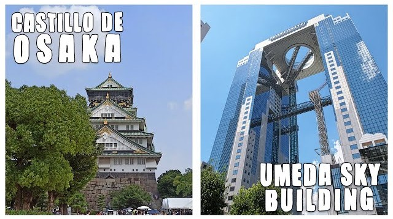

**Mañana:** Castillo de Osaka y su parque — buena sesión de fotos con vistas históricas.

**Mediodía:** Almuerzo en **Umeda**; sube al **Umeda Sky Building** para vistas panorámicas de la ciudad (muy Instagram-friendly).

**Atardecer/Noche:** Explora **Shinsekai** — la "Times Square" de Osaka. Luces de neón, tiendas retro, izakayas, karaoke. Ambiente joven y vibrant.

| Horarios Sugeridos |
|---|
| 08:30 – Desayuno y salida hacia Castillo |
| 09:30 – Visita al Castillo (1–2h si entráis) |
| 12:00 – Almuerzo en Umeda |
| 13:30 – Umeda Sky Building (entrada ¥1,500; vistas 360°) |
| 15:30 – Paseo por Namba / compras últimas cosas |
| 18:00 – Shinsekai: paseo y ambiente |
| 19:30 – Cena kushikatsu o izakaya |
| 21:00 – Karaoke (optional pero recomendado) |
| 23:00 – Regreso al hotel |

💰 **Coste (por persona):**
- Castillo: ¥1,500 (~€10)
- Umeda Sky Building: ¥1,500 (~€10)
- Comidas: ¥3,000–5,000 (~€20–35)
- Karaoke (2h): ¥3,000–5,000 (~€20–35)
- **Total: €60–90**

🎤 **Karaoke en Shinseaki:**
- **Big Echo** — cadena popular, sucursal en Shinseaki
- Precio: ~¥300–500/persona/hora + bebidas

---

### Día 5 — Lunes 9 Marzo: Kuromon Market + Últimas Compras + Salida a Kyoto

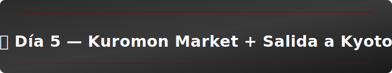

**Mañana:** Paseo por **Kuromon Ichiba** — desayunos de mercado, sushi ultra-fresco, snacks locales. Es la experiencia "Japan real" después de días frikis.

**Mediodía/Tarde:** Últimas compras en **Dotonbori** o regresar a **Den Den Town** si faltó algo.

**Traslado a Kyoto:** Salida tranquila por la tarde (~17:00–18:00) hacia Kyoto. Metro + tren JR Kyoto Line (~90 minutos).

| Horarios Sugeridos |
|---|
| 08:00 – Desayuno en Kuromon Ichiba |
| 09:00 – Paseo por Kuromon (compras, snacks, fotos) |
| 11:00 – Regreso a hotel / recopilación de compras |
| 12:30 – Almuerzo en Namba / compras últimas |
| 15:00 – Regreso al hotel, check-out, organización de equipaje |
| 17:00 – Traslado a estación (Osaka/Tennoji) |
| 18:30 – Llegada a Kyoto, check-in nuevo hotel |
| 20:00 – Cena ligera en Kyoto y descanso |

💰 **Coste (por persona):**
- Kuromon (desayuno + snacks): ¥2,000–3,000 (~€14–20)
- Almuerzo: ¥1,500–2,500 (~€10–18)
- Tren a Kyoto (JR): ¥1,100 (~€8)
- **Total: €32–46**

🍣 **Kuromon Must-Try:**
- **Sushi fresco** en los puestecillos (¥5–10/pieza)
- **Uni (erizo de mar)** — caro pero probad uno (¥500–800 por pieza)
- **Takoyaki** — de nuevo, para cerrar Osaka con sabor

🍜 **Almuerzo Namba:**
- **Ramen Yokocho** — callejuela completa de ramen shops
- **Okonomiyaki** — crepas savory; perfectas antes de viajar

---

## 📊 PRESUPUESTO TOTAL OSAKA (5 días, por persona)

| Concepto | Presupuesto |
|---|---|
| **Universal Studios + Express 7** | €280–290 |
| **Comidas (mix mercado/izakaya)** | €120–150 |
| **Transporte local (metro, tren)** | €30–40 |
| **Entradas (Castillo, Umeda Sky)** | €20 |
| **Karaoke / ocio nocturno** | €25 (opcional) |
| **TOTAL OSAKA (sin alojamiento ni compras)** | **€475–525** |

✅ **Alojamiento ya pagado. Compras: cada uno lo que quiera. Con este presupuesto, cubres lo esencial de Osaka.**

---

## 🏛️ KYOTO (9–13 Marzo — 4 Noches)

Kyoto es la capital cultural de Japón. Aquí nos enfocamos en lo **clásico, zen y tradicional** — un contraste perfecto después de Osaka. Tres días completos de templos, geishas, mercados y caminatas por callejuelas históricas.

### 🗺️ Mapa Interactivo de Kyoto

📍 **[Ver mapa de puntos de interés](https://www.google.com/maps/d/viewer?mid=1j4zyYtK6MPShp8-3PjaSHWdCEp1bg4c&femb=1&ll=35.00354009897058%2C135.73337915&z=14)**

---

### Día 6 — Martes 10 Marzo: Kyoto Tradicional — Gion, Kiyomizudera, Nishiki Market

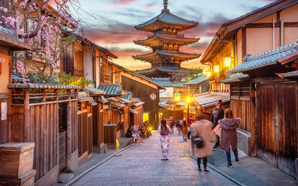

**Plan:** Día 1 de Kyoto = tradición pura. Templos históricos, geishas en Gion, mercado tradicional y cena en Pontocho.

#### 🏯 KIYOMIZUDERA (Templo del Agua Pura)

Ubicación: Este de Kyoto (Higashiyama Ward)  
Horarios: 06:00–18:00 (abierto todo el año)  
Entrada: ¥400 (~€2,80)  
Cómo llegar: **Bus 100/206** → parada "Kiyomizudera-michi" (10 min caminando desde parada)

**Por qué ir:** El templo más icónico de Kyoto. Terraza de madera suspendida = vistas imposibles de la ciudad. Foto obligatoria.

💰 **Entradas:**
- Acceso general: ¥400 (taquilla)
- **NO se venden online** — pagar en taquilla

📱 **Instagram Alert:** La plataforma de madera al atardecer es viral en redes. Llega antes de las 16:00 para luz dorada.

#### 🌸 HIGASHIYAMA (Calles históricas)

Desde Kiyomizudera baja por las calles típicas. Aquí encontrarás:
- **Ninenzaka y Sannenzaka** — tiendas de souvenirs, té, artesanías
- **Restaurantes tradicionales** — matcha, dango, yudofu (tofu hervido)

#### 🎭 GION (Distrito de Geishas)

Ubicación: Centro-este de Kyoto  
Atmosfera: Geishas al atardecer (17:00–18:30), calles de madera roja, izakayas tradicionales  
Cómo llegar: Metro Kawaramachi + caminar, o bus directo

**Lo especial:** Gion es *la* zona histórica. Por la noche, ves geishas yendo al trabajo (respeta — no fotos sin permiso). Callejuelas perfectas para fotos de Instagram.

#### 🍱 NISHIKI MARKET (Mercado de los 400 años)

Ubicación: Centro de Kyoto  
Horarios: 10:00–18:00 (algunos cierran lunes)  
Entrada: Gratis  
Especialidades: Sushi, uni, pickles, matcha, miso

Cómo llegar: Metro Kawaramachi  
Tiempo: 1–2 horas navegando

#### 🍴 PONTOCHO (Cena Tradicional)

Pontocho es una *maiko* (calle geisha) paralela a Gion, más tranquila. Aquí cenas viendo el río Kamogawa.

Restaurantes recomendados (reserva con antelación):
- **Gion Tanto** — kaiseki tradicional (¥8,000–15,000)
- **Kappa Zushi** — sushi de río (¥5,000–8,000)
- **Pontocho Kappa Zushi** — experiencia con vistas al río (¥4,000–6,000)

| Horarios Sugeridos |
|---|
| 08:30 – Desayuno y salida a Kiyomizudera |
| 09:30 – Visita Kiyomizudera (entradas taquilla: ¥400) |
| 11:30 – Paseo por Higashiyama (Ninenzaka, Sannenzaka) |
| 13:00 – Almuerzo en Higashiyama (matcha + dango) |
| 14:30 – Nishiki Market (browsing, snacks) |
| 16:30 – Paseo por Gion (fotos, atmosfera) |
| 17:30 – Tomar café/té antes de cenar |
| 19:00 – Cena en Pontocho (reserva recomendada) |
| 21:00 – Regreso al hotel |

💰 **Coste (por persona):**
- Kiyomizudera: ¥400 (~€2,80)
- Almuerzo Higashiyama: ¥2,000–3,000 (~€14–21)
- Nishiki Market snacks: ¥1,500–2,000 (~€10–14)
- Cena Pontocho: ¥4,000–6,000 (~€28–42)
- Transporte (buses): ¥1,000 (~€7)
- **Total: €62–84**

---

### Día 7 — Miércoles 11 Marzo: Norte de Kyoto — Arashiyama, Templos Zen, Camino del Filósofo

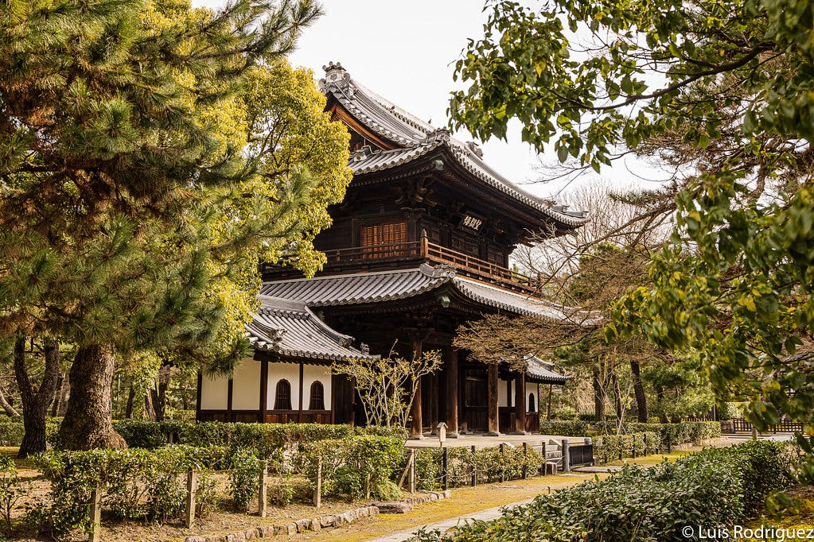

**Plan:** Día 2 de Kyoto = naturaleza + templos zen. Bosque de bambú, templos tranquilos, camino filosófico junto al río.

#### 🎋 ARASHIYAMA (Bosque de Bambú)

Ubicación: Oeste de Kyoto  
Horarios: Abierto 24h (mejor 07:00–09:00 antes de turistas)  
Entrada: Gratis (algunas áreas tienen pequeños templos con entrada ¥400–600)  
Cómo llegar: **JR Sagano Line → Saga-Arashiyama Station** o Hankyu desde Kawaramachi

**Lo especial:** 10,000 bambúes creando un "túnel verde". Camina lentamente, respira, toma fotos. Es meditativo.

📱 **TikTok Tip:** Llega ANTES de las 08:30. Después = hordes de turistas.

#### 🏯 TENRYU-JI (Templo del Dragón Celestial)

Ubicación: Arashiyama  
Horarios: 08:30–17:00 (08:20–16:50 en invierno)  
Entrada: 
- Jardín solamente: ¥900
- Jardín + interiores: ¥1,500

**Por qué:** Uno de los 5 Grandes Templos Zen de Kyoto. Jardín hermoso, arquitectura zen pura.

💡 Compra entradas en taquilla o **online en Lawson (7-Eleven)** si quieres evitar colas.

#### 🌲 KINKAKU-JI (Pabellón Dorado)

Ubicación: Norte de Kyoto  
Horarios: 09:00–17:00  
Entrada: ¥400 (taquilla solamente)  
Cómo llegar: Bus 101 desde Kyoto Station (40 min)

**Lo especial:** El templo **más fotografiado de Japón**. Pabellón cubierto en oro reflejado en el agua. Cumple el meme "it's beautiful" de Internet.

⏰ Llega **antes de las 10:00** o después de las 15:00. Mediodía = turistas masivos.

#### 🔘 RYOAN-JI (Templo del Jardín de Piedras)

Ubicación: Noroeste de Kyoto (camino Filosofía)  
Horarios: 08:00–17:00 (08:00–16:30 en invierno)  
Entrada: ¥500 (taquilla)  
Cómo llegar: Bus 59 desde Kinkakuji (~10 min)

**Lo especial:** Jardín zen minimalista de 15 piedras. Meditación en forma de rocas. Es *tranquilo*, contrasta con Kinkakuji.

#### 🚶 PHILOSOPHER'S PATH (Camino del Filósofo)

Ubicación: Este de Kyoto (paralelo al canal Biwa)  
Horarios: Abierto 24h  
Entrada: Gratis  
Tiempo: 2 km caminata (1–2 horas tranquilas)

**Lo especial:** Camino junto a un canal con cerezos. En primavera, los cerezos explotan en flores. Incluso en marzo, es zen.

Templos cercanos (si tienes tiempo):
- **Ginkaku-ji** (Pabellón de Plata): ¥500, similiar a Kinkakuji pero menos turistas
- **Nanzen-ji**: ¥600, acueducto icónico

#### 🌃 GION (Noche)

Por la noche, regresa a Gion. Misma atmósfera que Día 6, pero si no lo viste bien, segunda oportunidad.

| Horarios Sugeridos |
|---|
| 07:00 – Salida a Arashiyama |
| 08:00 – Bosque de bambú (fotos antes de multitudes) |
| 09:30 – Tenryu-ji (entrada ¥900–1,500) |
| 11:00 – Almuerzo en Arashiyama |
| 13:00 – Bus a Kinkakuji |
| 14:00 – Kinkakuji (¥400) |
| 15:30 – Ryoan-ji (¥500) |
| 16:30 – Philosopher's Path (camino tranquilo) |
| 18:00 – Regreso a centro, cena en Gion |
| 20:00 – Regreso al hotel |

💰 **Coste (por persona):**
- Tenryu-ji: ¥1,500 (~€10.50)
- Kinkakuji: ¥400 (~€2,80)
- Ryoan-ji: ¥500 (~€3,50)
- Almuerzo: ¥1,500–2,500 (~€10–18)
- Cena Gion: ¥3,000–5,000 (~€21–35)
- Transporte (buses): ¥1,500 (~€10.50)
- **Total: €68–80**

---

### Día 8 — Jueves 12 Marzo: Sur de Kyoto — Fushimi Inari, Tofuku-ji, Torre de Kyoto

**Plan:** Día 3 de Kyoto = torii rojo, templos menos conocidos, vistas panorámicas desde la torre.

#### 🔴 FUSHIMI INARI TAISHA (Los Torii Rojo)

Ubicación: Sur de Kyoto  
Horarios: Abierto 24h  
Entrada: Gratis  
Cómo llegar: **JR Nara Line → Inari Station** (~30 min desde centro) o Keihan Fushimi-Inari

**Lo especial:** 10,000+ pórticos torii rojos formando "túneles". Es IMPRESIONANTE. Fotos = garantizadas.

⏰ **IMPORTANTE:** Llega **ANTES de las 07:30** si quieres fotos sin gente. Después de las 09:00 = turistas masivos.

📸 Sube 45 min a pie por los túneles. Vistas de Kyoto desde arriba. Trae agua.

#### 🏯 TOFUKU-JI (Templo del Acer Japonés)

Ubicación: Sur-este de Kyoto  
Horarios: 09:00–16:00 (cerrado lunes)  
Entrada: ¥600 (taquilla)  
Cómo llegar: JR Nara Line → Tofukuji Station (10 min caminando)

**Lo especial:** Menos turistas que otros templos. Famoso por el puente "Tsutenkyo" (Puente del Cielo) con vistas de arces. En otoño = espectáculo de colores. En marzo = verde.

#### 🗼 KYOTO TOWER (Torre de Kyoto)

Ubicación: Kyoto Station (centro)  
Horarios: 08:30–21:00 (última entrada 20:40)  
Entrada: ¥800 (observatorio)  
Cómo llegar: Directamente desde Kyoto Station

**Lo especial:** Vistas panorámicas de toda Kyoto. Atardecer = perfecto. Ves el valle rodeado de montañas.

| Horarios Sugeridos |
|---|
| 06:30 – Salida temprano a Fushimi Inari |
| 07:00 – Llegada a Inari Station |
| 07:30 – Inicio paseo torii (fotos antes de multitudes) |
| 09:30 – Almuerzo cerca de Inari |
| 11:00 – JR a Tofukuji |
| 11:30 – Visita Tofuku-ji (¥600) |
| 13:30 – Almuerzo tradicional |
| 15:00 – Kyoto Tower (¥800) |
| 16:30 – Paseo por Kyoto Station / compras últimas |
| 18:00 – Cena en zona Station (último día en Kyoto) |
| 19:30 – Preparar equipaje para Tokio (sale mañana) |

💰 **Coste (por persona):**
- Fushimi Inari: Gratis
- Tofuku-ji: ¥600 (~€4,20)
- Kyoto Tower: ¥800 (~€5,60)
- Almuerzo: ¥2,000–3,000 (~€14–21)
- Cena Station: ¥2,000–3,500 (~€14–25)
- Transporte: ¥1,000 (~€7)
- **Total: €50–63**

---

### Día 9 — Viernes 13 Marzo: Mañana en Kyoto + Salida a Tokio (Shinkansen)

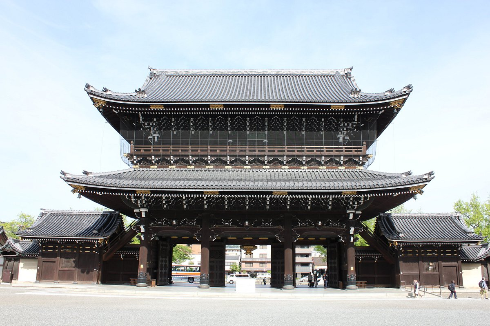

**Plan:** Último día en Kyoto. Mañana tranquila cerca del hotel Kyoto Station, luego Shinkansen a Tokio.

#### 🛕 OPCIONES CERCA DE KYOTO STATION:

**Opción 1: Templo Hongan-ji (Monzeki Palaces)**
- Ubicación: 5 min caminando desde Kyoto Station
- Horarios: 08:30–17:00
- Entrada: Gratis (donativos bienvenidos)
- **Por qué:** Uno de los templos budistas más importantes de Japón. Arquitectura impresionante, sin el tumulto de otros templos. Perfecto para una mañana relajada.

**Opción 2: Ishiyama Hongan-ji**
- Ubicación: 10 min en metro desde Kyoto Station
- Horarios: 09:00–16:00
- Entrada: Gratis
- **Por qué:** Templo zen tranquilo, ideal para mediación. Pocas hordas de turistas.

**Opción 3: Centros comerciales Kyoto Station**
- **Kyoto Station Building** — tiendas, restaurantes, últimas compras
- **Isetan** — departamento de lujo
- **The Cube** — tiendas y ropa

#### ☕ CAFÉ/DESAYUNO

Antes de irte, toma un **matcha latte** en algún café de Kyoto Station. Es la forma perfecta de despedirse de Kyoto.

| Horarios Sugeridos |
|---|
| 07:30 – Desayuno tranquilo en hotel |
| 08:30 – Visita rápida a Hongan-ji (~1 hora) |
| 09:45 – Matcha café / últimas compras |
| 11:00 – Check-out, equipaje al guardarropa |
| 11:30 – Comida ligera antes del tren |
| 13:00 – Tren Shinkansen Hikari → Tokio (reserva asiento) |
| 15:30 – Llegada Tokio Station |
| 16:00 – Check-in hotel Tokio |
| 17:00 – Descanso / exploración zona hotel |
| 19:00 – Cena en Shinjuku o Ginza |

💰 **Coste (por persona):**
- Hongan-ji: Gratis (donativo opcional ¥500)
- Matcha café: ¥800–1,200 (~€5–8)
- Comida: ¥1,500–2,000 (~€10–14)
- Shinkansen Hikari (Kyoto → Tokio): ¥13,500–14,500 (~€95–100)
- **Total: €110–122**

---

## 📊 PRESUPUESTO TOTAL KYOTO (3.5 días, por persona)

| Concepto | Presupuesto |
|---|---|
| **Templos (entradas)** | €13–26 |
| **Comidas (mercado, restaurantes)** | €55–90 |
| **Transporte (buses, metro, JR local)** | €30–40 |
| **Shinkansen a Tokio** | €95–100 |
| **TOTAL KYOTO (sin alojamiento)** | **€193–256** |

✅ **Kyoto es más barata que Osaka, pero el Shinkansen suma.** El viaje vale la pena para ese tren bala de lujo.

---

Restaurantes recomendados:

- Omen (udon tradicional cerca de Gion) — platos caseros y reconfortantes.
- Izuju Sushi — especialidad local de Kyoto.

Alternativa por mal tiempo:

- Visitar museos cercanos (Kyoto National Museum) o probar una experiencia de ceremonia del té cubierta.

Consejos extra:

- Evitad llevar maletas grandes en las calles estrechas; hay servicios de entrega de equipaje entre hoteles si necesitáis mover maletas.

---

## 🗾 TOKIO (13–19 Marzo — 6 Noches + 1 Vuelo)

Tokio = caos, energía, modernidad y friki heaven. Arcade games, tiendas de ropa, barrios cyberpunk, coches tunning y fiesta. Esto es lo nuestro.

---

### Día 10 — Viernes 13 Marzo: Llegada a Tokio + Doikoku Parking (Coches Tunning)

**Plan:** Llegas a Tokio a las 15:30. Check-in rápido. **Viernes por la noche = Doikoku Parking** (es LEGENDARIO en TikTok/YouTube).

#### 🚗 DOIKOKU PARKING (Cultura Tunning Japonesa)

Ubicación: Yokohama (45 min desde Tokio en tren)  
Horarios: 22:00–05:00 (abierto viernes-domingo noches)  
Entrada: Gratis (bebidas en el bar, opcional)

**Lo especial:** Underground car meet. Coches tunning criminales, modificados, bajos extremos. Fotógrafos, tuners, ambiente demente. Esto es puro Japón otaku-motor.

**Cómo llegar:**
- Metro desde tu hotel a **Sakuragicho Station**
- Bus o taxi a Doikoku Parking
- O directamente taxi (¥4,000–5,000 desde Shinjuku)

| Horarios Sugeridos |
|---|
| 15:30 – Llegada Tokio Station |
| 16:00 – Traslado a hotel + check-in |
| 16:30 – Ducha y descanso (importante: llegas cansado del Shinkansen) |
| 18:00 – Cena temprano en Shinjuku |
| 20:00 – Traslado a Doikoku Parking |
| 22:00–02:00 – Doikoku (fotos, videos, ambiente) |
| 02:30 – Regreso al hotel |

💰 **Coste (por persona):**
- Transporte Doikoku: ¥2,000–3,000 (~€14–21)
- Bebidas/comidas Doikoku: ¥1,000–2,000 (~€7–14)
- Cena Shinjuku: ¥2,000–3,000 (~€14–21)
- **Total: €35–56**

---

### Día 11 — Sábado 14 Marzo: MEGADÍA Tokio (Este + Oeste + Fiesta)

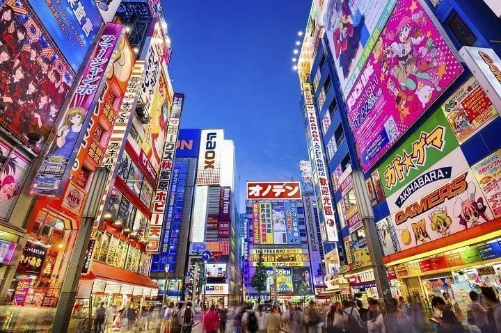

**Plan:** Sábado = la mitad del día turismo, la otra mitad = DESCANSO/DUCHA, y por la noche = ROPPONGI FIESTA.

#### 🏮 SECTOR ESTE: Asakusa → Akihabara → Ginza → Odaiba

| Horarios Sugeridos |
|---|
| 08:00 – Desayuno en hotel |
| 08:30 – Salida a **Asakusa** (Metro Ginza Line) |
| 09:00 – Templo Sensoji (gratis, entrada libre) |
| 09:45 – Nakamise-dori (compras, souvenirs, snacks) |
| 11:00 – Traslado a **Akihabara** (5 min metro) |
| 11:15 – Akihabara (arcades, tiendas electrónica, maid cafés) |
| 13:00 – Almuerzo Akihabara |
| 14:30 – Traslado a **Ginza** (10 min metro) |
| 15:00 – Ginza (shopping luxury, tiendas Samsung, Apple, moda) |
| 16:30 – Traslado a **Odaiba** (monorraíl futurista) |
| 17:00 – Odaiba (Statue of Liberty replica, Tokyo Rainbow Bridge, teamLab Borderless si hay tiempo) |
| 18:30 – Regreso al hotel + DUCHA + DESCANSO |

#### 🌃 SECTOR OESTE: Shibuya → Roppongi

| Horarios Sugeridos (Noche) |
|---|
| 20:00 – Salida a **Shibuya** |
| 20:15 – Cruce de Shibuya + Estatua Hachiko (fotos noche = brutal) |
| 20:45 – **Shibuya Sky** (entrada ¥2,000, observatorio al atardecer/noche) |
| 22:00 – Paseo por Shibuya de noche: Shibuya Center-gai, Shibuya 109, callecitas con izakayas y bares pequeños para tomar algo y seguir haciendo fotos. |
| 23:30 – Traslado a **Roppongi** (15 min metro) |
| 00:00–03:00 – **ROPPONGI FIESTA:** Discotecas/bares |
| 03:00–04:00 – **GACHA SHOPS NOCTURNAS:** Antes de irte, pasa por gacha arcades (están abiertas 24h) |
| 04:30 – Regreso al hotel (taxi o metro 24h) |

#### 🎢 OPCIONALES (si te apetece):

- **Shibuya 109** (tiendas de ropa/moda)
- **Tokyo Skytree** (¥2,100, observable desde Odaiba)

💰 **Coste (por persona):**
- Asakusa/Akihabara: ¥2,000–4,000 (~€14–28)
- Ginza: ¥1,000–3,000 compras (libre)
- Odaiba: ¥0 (gratis pasear), teamLab ¥3,200 si entras
- Shibuya Sky: ¥2,000 (~€14)
- Roppongi (bebidas, entrada discoteca): ¥5,000–10,000 (~€35–70)
- **Total: €63–145** (sin compras Ginza)

---

### Día 12 — Domingo 15 Marzo: MEIJI + HARAJUKU + SHINJUKU + KABUKICHO

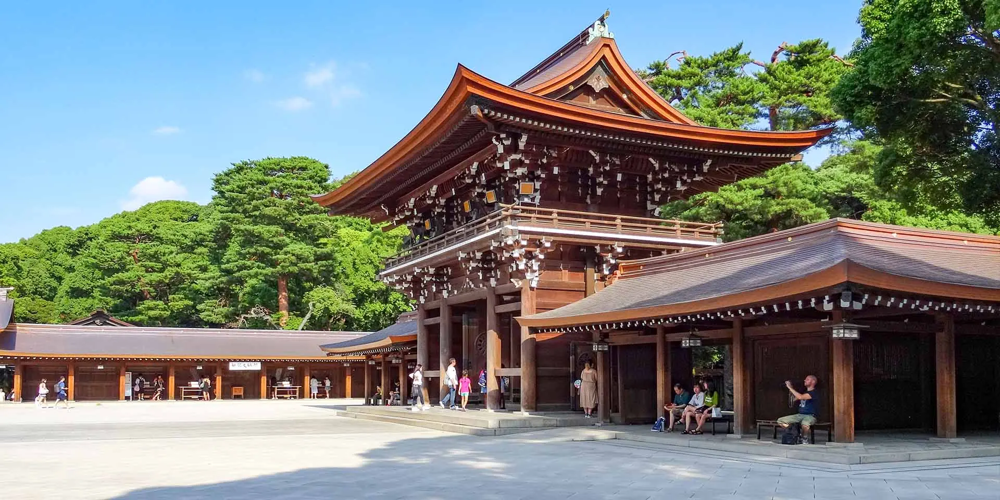

**Plan:** Domingo = barrios clásicos + compras + zona de luces rojas.

#### ⛩️ SANTUARIO MEIJI + JARDÍN IMPERIAL MEIJI JINGU

Ubicación: Shibuya Ward  
Horarios: 05:00–18:00 (jardín 09:00–16:00)  
Entrada: Gratis (santuario), ¥500 jardín  
Cómo llegar: JR Yamanote Line → Meiji-Jingu Station (1 min caminando)

**Lo especial:** Santuario histórico en medio del bosque. Zen puro. Menos turistas si llegas temprano.

#### 🌳 PARQUE YOYOGI

Ubicación: Junto a Meiji Jingu  
Horarios: Abierto 24h  
Entrada: Gratis  
**Lo especial:** Parque gigante con árboles, ciclocarriles, ambiente relajado.

#### 👘 HARAJUKU (Takeshita Dori)

Ubicación: Centro Shibuya  
Horarios: Tiendas 11:00–19:00  
Atmósfera: Fashion street pura. Crepes callejeros, tiendas de ropa alternativa, fotógrafos.

**Tiendas imprescindibles:**
- **Takeshita Dori** — crepes, ropa kawaii, tiendas alternativas
- **Omotesando** — arquitectura moderna, diseñador

#### 🌳 SHINJUKU GYOEN

Ubicación: Shibuya  
Horarios: 09:00–16:00 (cerrado lunes)  
Entrada: ¥500  
**Lo especial:** Jardín tradicional japonés. Estanques, puentes. Contrasta con caos Shinjuku.

#### 🏙️ SHINJUKU (Barrio de Luces + Ayuntamiento)

**Kabukicho** (Barrio rojo):
- Pubs, karaoke, desnudistas, neon
- Respeta = mira pero no toques

**Omoide Yokocho** (Callejón de Recuerdos):
- Izakayas viejos, yakitori, atmósfera retro

**Ayuntamiento de Tokio** (Tokyo Metropolitan Building):
- Entrada gratis
- Observatorio piso 45 (vistas Tokio gratis)

| Horarios Sugeridos |
|---|
| 07:00 – Salida a Meiji Jingu (llegada temprana = sin turistas) |
| 08:00 – Paseo santuario (30 min tranquilo) |
| 08:45 – Parque Yoyogi (camina, respira, toma café) |
| 10:00 – Harajuku: Takeshita Dori + crepes |
| 12:00 – Almuerzo Harajuku (ramen, sushi, crepes) |
| 14:00 – Shinjuku Gyoen (camina jardín, fotos) |
| 15:30 – Ayuntamiento Tokio (observatorio gratis, 20 min fotos) |
| 16:30 – Kabukicho / Omoide Yokocho (paseo, ambiente) |
| 18:00 – Cena Omoide Yokocho (yakitori local, ¥2,000–3,000) |
| 20:00 – Karaoke o izakaya tradicional |
| 22:00 – Regreso hotel (descanso; mañana: conducir GTR) |

💰 **Coste (por persona):**
- Meiji Jingu jardín: ¥500 (~€3,50)
- Shinjuku Gyoen: ¥500 (~€3,50)
- Comidas (Harajuku crepes, almuerzo, cena): ¥4,000–6,000 (~€28–42)
- Karaoke (1–2h): ¥2,000–4,000 (~€14–28)
- **Total: €49–77**

---

### Día 13 — Lunes 16 Marzo: PALACIO IMPERIAL + TSUKIJI + UENO + TOKYO TOWER + SKYTREE

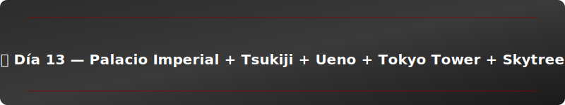

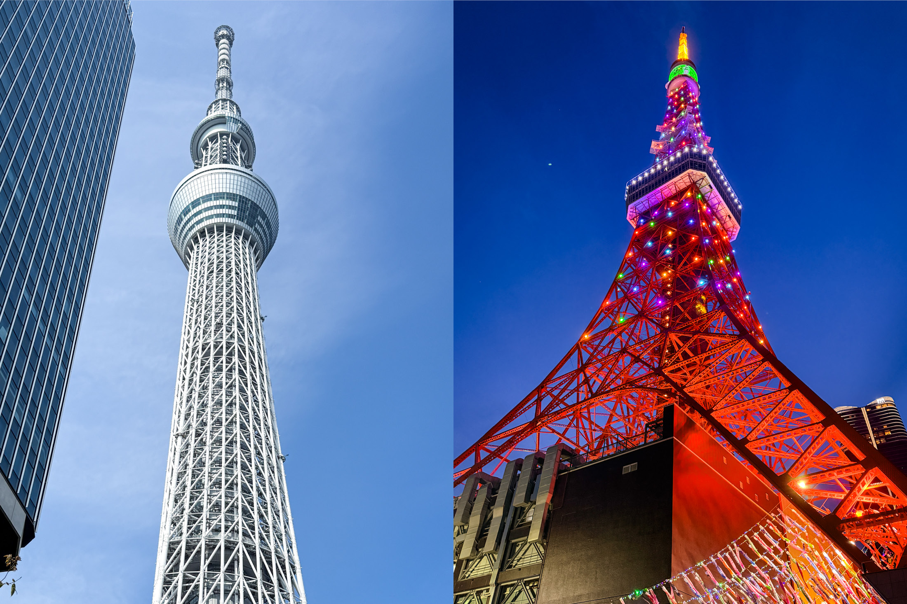

**Plan:** Lunes = todos los landmark clásicos. Mañana dedicada a esto, **tarde/noche: NISSAN GTR EXPERIENCE** 🏎️

#### 🏯 PALACIO IMPERIAL

Ubicación: Centro Tokio  
Horarios: Jardines abiertos 09:00–16:00 (cerrado lunes)  
Entrada: Gratis  
Cómo llegar: Metro Chiyoda Line → Otemachi

**Lo especial:** Palacio del Emperador. Jardines hermosos pero fotografía limitada. Respeta protocolos.

#### 🍣 TSUKIJI OUTER MARKET

Ubicación: Ginza  
Horarios: 05:00–14:00 (mejor ir temprano)  
Entrada: Gratis (compras opcionales)  
**Lo especial:** Mercado de sushi/pescado. Sushi fresco para desayunar (¥1,000–2,000 por plato premium).

#### 🏯 JARDINES HAMARIKYU

Ubicación: Ginza (5 min desde Tsukiji)  
Horarios: 09:00–16:30  
Entrada: ¥300  
**Lo especial:** Jardín tradicional al lado del agua. Té de matcha en casa de té histórica (¥1,050).

#### 🗼 TOKYO TOWER

Ubicación: Minato Ward  
Horarios: 09:00–23:00  
Entrada: ¥900 (Main Deck)  
**Lo especial:** Torre icónica. Roja. Vistas de Tokio. Menos turistas que Skytree.

#### 🌸 PARQUE DE UENO

Ubicación: Centro-norte Tokio  
Horarios: Abierto 24h  
Entrada: Gratis (museos dentro cobran)  
**Lo especial:** Parque gigante con museos, lagos, templos.

#### 🏪 AMEYOKO STREET

Ubicación: Ueno  
Horarios: 10:00–19:00  
**Lo especial:** Calle comercial viejita. Tiendas alternativas, ropa de segunda mano, snacks raros.

#### 🗼 TOKYO SKYTREE

Ubicación: Este Tokio  
Horarios: 08:00–21:00  
Entrada: ¥2,100 (observatorio principal)  
**Lo especial:** Torre más alta Japón (634m). Espectacular.

---

#### 🏎️ NISSAN GTR ALQUILER (Tarde/Noche - LO IMPORTANTE)

**ALQUILER GTR EN TOKIO:**

- **Nissan Rent-a-Car** — reserva online, necesitas licencia internacional
- **Skyline Club Tokyo** — especializada en alquileres deportivos
- Coste: ¥20,000–30,000 (~€140–210) por 2–3 horas
- Conduces tú mismo por Tokio y alrededores (bahía Tokyo es épica de noche)

**Requisitos:**
- Pasaporte + licencia internacional
- Tarjeta de crédito (depósito)
- Edad mínima: 20 años

**Tips:**
- Reserva con 1 semana de anticipación
- Pide GTR R34 o R35 si es posible
- Fotos de noche en bahía Tokyo = BRUTAL
- Lleva GoPro/cámara para video

| Horarios Sugeridos |
|---|
| 08:00 – Desayuno |
| 08:30 – Tsukiji (sushi fresco para desayunar) |
| 10:00 – Palacio Imperial jardines |
| 11:00 – Hamarikyu (té matcha, ¥1,050) |
| 12:30 – Almuerzo zona Ginza |
| 14:00 – Tokyo Tower (¥900) |
| 15:30 – Parque Ueno + Ameyoko Street |
| 17:00 – Regreso hotel, ducha, preparación |
| 18:00 – **RECOGIDA GTR EN RENTAL** |
| 18:30–21:30 – **CONDUCIR GTR POR TOKIO (fotos, bahía, noche)** |
| 21:30 – Devolver coche rental |
| 22:00 – Cena celebración GTR en Roppongi |
| 23:30 – Regreso hotel |

💰 **Coste (por persona):**
- Tsukiji (sushi): ¥2,000–3,000 (~€14–21)
- Hamarikyu: ¥1,350 (~€9,50)
- Palacio/museos: Gratis
- Tokyo Tower: ¥900 (~€6,30)
- Ueno: Gratis
- **GTR Alquiler: ¥20,000–30,000 (~€140–210)**
- Combustible: ¥3,000–5,000 (~€21–35)
- Cena: ¥3,000–5,000 (~€21–35)
- **Total: €212–325** (con GTR alquiler)

---

### Día 14 — Martes 17 Marzo: ABC MART + COMPRAS FINALES + TIEMPO LIBRE

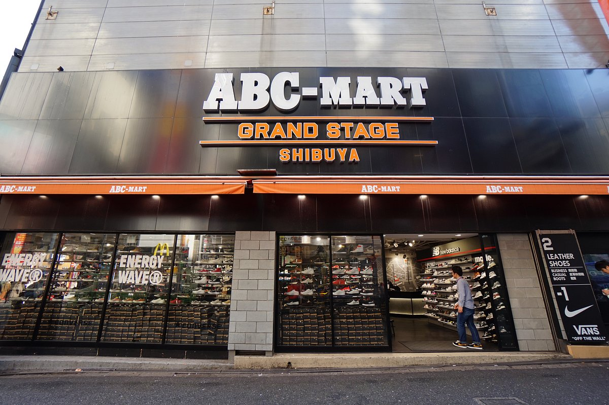

**Plan:** Día libre para compras (ABC Mart, ropa, souvenirs) y descanso.

#### 👟 ABC MART

Ubicación: Multiple (Shinjuku, Shibuya, Harajuku)  
Horarios: 11:00–21:00 (típicamente)  
**Lo especial:** Zapatería gigante. Deportivas, sneakers, marcas. Precios decentes.

**Sucursales:**
- **Shinjuku 3-Chome** (más grande)
- **Shibuya Scramble**

#### 👕 OTRAS COMPRAS:

- **Uniqlo** — ropa casual, precios bajos
- **H&M / Zara** — moda española en Japón
- **Isetan** — departamentos lujo (Shinjuku)
- **Don Quijote** — de todo a precio random

| Horarios Sugeridos |
|---|
| 10:00 – Desayuno tranquilo |
| 11:00 – ABC Mart (2–3 horas máximo) |
| 14:00 – Otras tiendas (según apetezca) |
| 16:00 – Café descanso |
| 17:00 – Últimas compras / paseo Shinjuku |
| 19:00 – Cena special (despedida Tokio) |
| 21:00 – Preparar equipaje |

💰 **Coste (por persona):**
- ABC Mart: ¥5,000–15,000 (~€35–105, según gastes)
- Otras compras: Libre
- Cena: ¥3,000–5,000 (~€21–35)
- **Total: €56–140** (sin excederse en compras)

---

### 📱 Día 15 — Miércoles 18 Marzo: FRIKI SHOPPING DAY

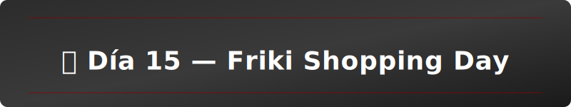

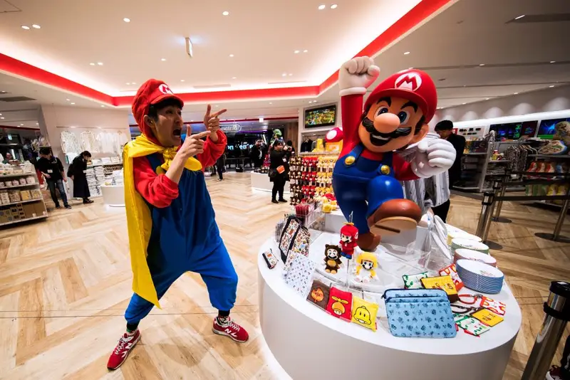

**Tema:** Tokio es el paraíso del gaming. Hoy es el día para Nintendo, Sony, arcades y máquinas de gacha. Shopping + diversión retro garantizado.

| Horario | Actividad |
|---------|-----------|
| 09:00–09:30 – Desayuno en el hotel |
| 10:00–11:30 – **NINTENDO STORE TOKIO** (Shinjuku) |
| 11:45–13:00 – Almuerzo rápido cerca de Shinjuku |
| 13:15–14:45 – **SONY STORE TOKIO** (Ginza) |
| 15:00–16:30 – **ARCADE CENTER RETRO** (Akihabara) |
| 16:45–18:00 – **UFO CATCHER & GACHA ZONE** (Akihabara) |
| 18:15–19:30 – Cena + compras finales en Akihabara |
| 19:30 – Regreso al hotel |

**🎮 NINTENDO STORE TOKIO** (Shinjuku)
- **Dirección:** Shinjuku Marui Men 3F, Tokio (a 5 min de Shinjuku Station)
- **Horario:** 11:00–20:00 (abierto todos los días)
- **Qué encontrar:**
  - Nintendo Switch exclusivas (modelos/colores Japón)
  - Pokemon merchandise (peluches, tarjetas, accesorios)
  - Zelda, Mario, Splatoon, Animal Crossing (todas las líneas)
  - Joy-Con personalizados y skins especiales
  - Accesorios gaming (mochilas, auriculares, cables)
- **Precio aprox:** ¥2,000–8,000/persona (€14–56)
- **Consejo:** Llega 15 min antes de abrir para evitar cola (este lugar llena enseguida)

**🕹️ SONY STORE / PLAYSTATION CENTER TOKIO** (Ginza)
- **Dirección:** Sony Park (Sony Building B1F), Ginza, Tokio
- **Horario:** 11:00–20:00 (cerrado lunes)
- **Qué encontrar:**
  - PlayStation 5 (si hay stock = oportunidad de merch exclusivo)
  - Mandos y accesorios PlayStation personalizados
  - Demo stations (juega últimos lanzamientos)
  - Sony tech (cámaras, auriculares, relojería)
  - Merch de franchises famosas (Final Fantasy, Street Fighter, etc.)
- **Precio aprox:** ¥1,500–6,000/persona (€10–42)
- **Consejo:** Es tienda tech premium; buen lugar para auriculares gaming o cargadores de lujo

**🎰 ARCADE CENTER RETRO** (Akihabara – "Game Center Kosaten" o "Sega Arcade")
- **Qué es:** Centro arcade con máquinas clásicas (Space Invaders, Pac-Man, DDR, beatmania) + arcade moderno
- **Ubicación:** Akihabara (zona Gaming central)
- **Horario:** 11:00–23:00 típicamente (algunos 24h)
- **Experiencia:**
  - Juega rhythm games (Dance Dance Revolution, Sound Voltex, BEMANI)
  - Prueba cabinas de competición retro
  - Juega juegos de disparos clásicos
  - Tómate un descanso con purikura (cabinas de fotos con stickers)
- **Precio aprox:** ¥2,000–3,500/persona (€14–25 en monedas)
- **Consejo:** Trae ¥1,000-2,000 en monedas; son máquinas arcade clásicas

**🎁 UFO CATCHER & GASHAPON ZONE** (Akihabara)
- **Qué son:** Máquinas UFO catcher (grúa para ganar peluches/premios) + dispensadores de gashapon (juguetes sorpresa en cápsulas)
- **Ubicación:** Akihabara (zona Radio Kaikan, Yodabashi, Don Quijote)
- **Gashapon disponibles:**
  - **Pokemon:** Pikachu, Charizard, Eevee, legendarios (¥300–500/cápsula)
  - **Demon Slayer:** Tanjiro, Nezuko, hashira (¥400–600/cápsula)
  - **Anime general:** Naruto, Dragon Ball, One Piece, Jujutsu Kaisen (¥300–500)
  - **Vintage:** Retro Nintendo, Game Boy, arcade cabinets (¥200–400)
- **Presupuesto:** ¥2,000–4,000/persona (€14–28) para varios gashapon
- **Consejo:** Apunta qué personajes quieres antes; cada máquina tiene 1-2 personajes específicos

**🚇 Cómo moverte:**
1. Shinjuku → Ginza: Tren Marunouchi Line (2 estaciones, 5 min)
2. Ginza → Akihabara: Tren Ginza Line (2 estaciones, 5 min) O Chiyoda Line (1 estación)
3. Akihabara: Todo está a pie (todas las tiendas en radio de 500m)

**💰 Presupuesto Día 15:**
| Concepto | Rango €/persona |
|----------|-----------------|
| Desayuno | 5–10 |
| Nintendo Store | 14–56 |
| Almuerzo | 8–15 |
| Sony Store | 10–42 |
| Arcade Center | 14–25 |
| UFO Catcher + Gashapon | 14–28 |
| Cena + compras | 20–40 |
| **TOTAL Día 15** | **85–216** |

**🏩 GASHAPON NIGHT OUTING (Bonus para Día 14 noche):**

Si después de Roppongi queréis "tirar unos gachapones", hay opciones 24h:
- **Don Quijote Shinjuku:** Pisos enteros de gashapon (3F+4F suelen ser gacha floors), ¥300–500/cápsula
- **Kiddyland Shinjuku:** Centro comercial juguetero con gacha machines, ¥300–600/cápsula
- **Sega Arcade Shinjuku:** Gaming + gashapon nocturnas, abierto hasta 23:00

**Nota:** La mayoría de hoteles en Tokio están en **Shinjuku area**, así que estas opciones están a 5-10 min a pie. Perfecto para una salida nochecita después de Roppongi (Día 14, Martes 17 Mar, ~02:00-03:00) o antes de volver Día 15.

---

### Día 16 — Jueves 19 Marzo: VUELO REGRESO A BILBAO

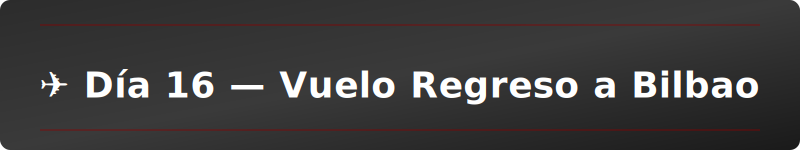

| Horarios Sugeridos |
|---|
| 05:30 – Despertarse (vuelo mañana temprano) |
| 06:00 – Desayuno rápido, check-out |
| 06:30 – Traslado aeropuerto (Narita/Haneda, ~1h desde centro) |
| 08:00 – Llegada aeropuerto |
| 08:30 – Trámites, seguridad |
| 10:00 – Última compra aeropuerto (snacks, souvenirs) |
| 10:30 – Embarque |
| 11:00 – Despegue Tokio → Zurich → Bilbao |
| 23:30 – Llegada Bilbao (18 horas después aprox) |

💰 **Coste (por persona):**
- Transfer aeropuerto: ¥3,000–5,000 (~€21–35)
- Snacks aeropuerto: ¥2,000–3,000 (~€14–21)
- **Total: €35–56**

---

## 📊 PRESUPUESTO TOTAL TOKIO (6 días + vuelo)

| Concepto | Presupuesto |
|---|---|
| **Doikoku Parking** | €35–56 |
| **Megadía Sábado (Este + Fiesta)** | €112–252 |
| **Domingo (Meiji + Harajuku + Shinjuku)** | €49–77 |
| **Lunes (Landmarks + GTR)** | €51–92 |
| **Martes (ABC + compras)** | €56–140 |
| **Miércoles (Friki Shopping Day)** | €85–216 |
| **Jueves (Aeropuerto + regreso)** | €35–56 |
| **TOTAL TOKIO (sin alojamiento)** | **€359–725** |

✅ **Tokio es caro pero VALE LA PENA.** Fiesta, coches, compras, temples, todo en uno. Es el cierre perfecto.

---

## 📊 PRESUPUESTO TOTAL JAPÓN (15 días completos)

| Concepto | Presupuesto/Persona |
|---|---|
| **Vuelos (ya pagado)** | **€860** |
| **Alojamiento (ya pagado)** | **€304** |
| **Osaka (Días 1-6)** | €475–525 |
| **Kyoto (Días 7-10, incluye Shinkansen)** | €193–256 |
| **Tokio (Días 11-17, sin alojamiento)** | €359–725 |
| **TOTAL ACTIVIDADES ESTIMADAS** | **€1,027–1,506** |
| **TOTAL GENERAL (sin contar vuelos/alojamiento ya pagados)** | **€1,027–1,506** |

**Nota:** El itinerario ya tiene vuelos y alojamiento completamente pagados (€1,164 de presupuesto total). Este presupuesto de actividades es ESTIMADO — podéis gastar menos en compras o más en experiencias premium (GTR, gacha machines, cenas especiales). El presupuesto es flexible según vuestras prioridades.

---

## 🎯 Highlights principales (Lo que NO os podéis perder)

✅ **Universal Studios con EXPRESS PASS** — €180–230 por persona  
✅ **Pokémon Center + Den Den Town** — €50–100 por persona (anime shopping día)  
<!-- Shibuya Street Kart eliminado del planning a petición del grupo -->
✅ **Doikoku Parking (22:00-05:00)** — €35–56 (coches tunning underground)  
✅ **Nissan GTR Alquiler (conducción propia)** — €140–210 (experiencia épica de conducción)  
✅ **Friki Shopping Day: Nintendo Store + Sony Store + Arcades** — €85–216 (última obsesión friki)  
✅ **Gacha Machines Night Outing** — €14–28 (bonus after Roppongi)  
✅ **Kyoto Tradicional (3 días sin repetir)** — €193–256 (cultura balance)  

---

## ✈️ Conclusión

**Viaje PERFECTO para vuestro perfil:** Jóvenes, friki, gamers, amantes de anime y tendencias viral. Hemos eliminado lo "aburrido" (Nara, días genéricos) y reemplazado por experiencias épicas que os encantarán.

**Timeline ideal:**
- **Osaka:** Introducción joven (Universal, Den Den Town, Shinsekai nightlife)
- **Kyoto:** Desconexión cultural (3 días distintos, nada repetido, templos icónicos)
- **Tokio:** CAOS total (Doikoku, megadías, GTR, friki shopping, gacha machines, fiesta)

**Presupuesto:** €1,164 por persona (vuelos + alojamiento ya pagados) + ~€1,100–1,500 en actividades/comidas/compras.

**¿LISTOS? 🚀**
